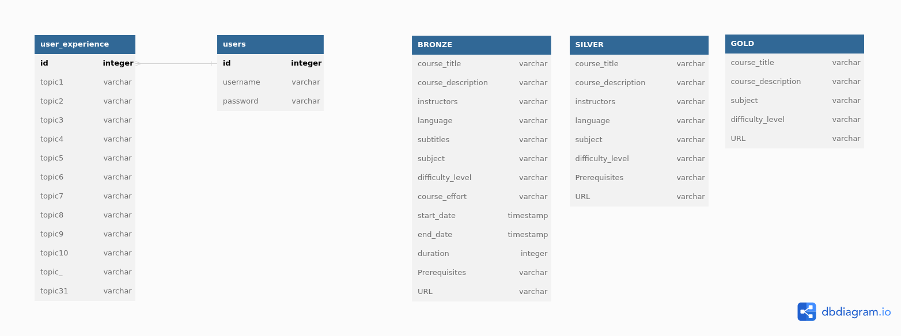
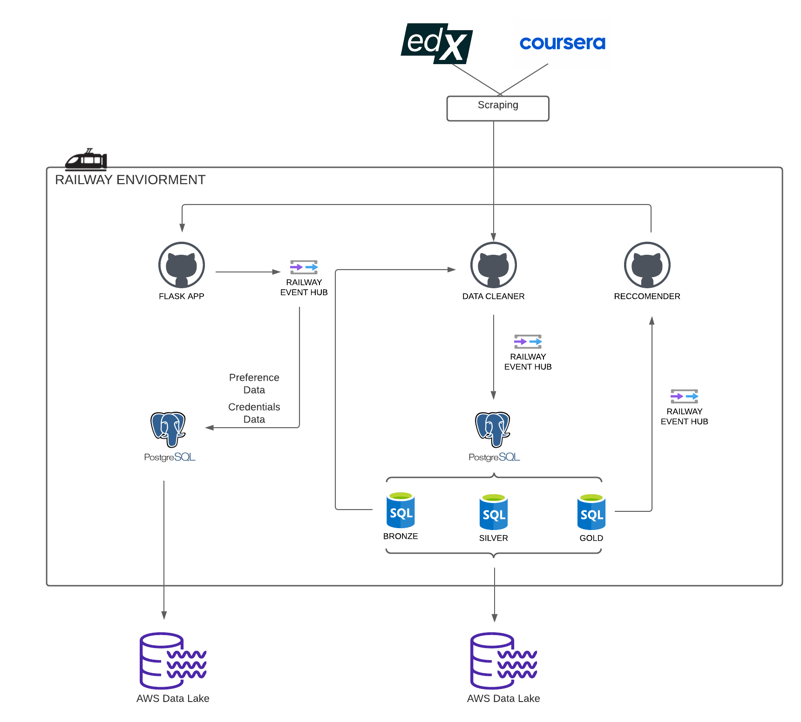

***WARNING***

*This repository is part of a project deployed on Railway, you can see the actual implementation working [here](https://moocreccomender-educational-curriculum-system.up.railway.app/) and the relative report here.

In order to deploy the application on a local or to a different cloud server you need to change the hostname to “localhost” or “127.0.0.1” or “hostname\_new\_server” and the port to “default”.

As you can see in the repo you will find a Procfile, which is required from Railway in order to be able to run your application. Remember also the Readme and License file.

 
 
 
***Abstract***

The objective of this project is to develop an online platform that generates personalized educational curriculum for individuals by applying a big data system. The platform dynamically adjusts the curriculum to align with the specific needs and preferences of each user. To construct the personalized curriculum, the platform exclusively recommends courses sourced from reputable MOOC platforms and academic institutions.

**Data**

The data that we use for this project it is available [here](https://www.kaggle.com/datasets/edx/course-study)

**Data collection organization of the storing part**

Example of how our databases are organized. 

**Technologies**

- Flask for the application
- Pandas for cleaning the data 
- Railway played a pivotal role in hosting and deploying our application. Additionally, it served as the data storage solution for our platform and facilitated connections to external services for application backups. Its significance lies in its ability to offer scalability options, ensuring seamless handling of application growth and managing higher user traffic.
- Postgres for the storing of our data
- AWS for the backup of our application

**Architecture**

This is the workflow of our system architecture.

**Link of the application:**

<https://moocreccomender-educational-curriculum-system.up.railway.app/>

**Organization of the code:**

**Application**. 

The central implementation of the application resides within the "app.py" file. It encompasses the creation of registration and sign-up features, the utilization of the Railway.app ecosystem to store user data in a PostgreSQL DB, and the implementation of the recommendation function. Additionally, the HTML components of each platform page are located in the "template folder".

**Data**

The data of the courses is shown in the file “[courses.csv](https://github.com/Chemo112/MOOC_RECCOMENDER/blob/main/course.csv)”. Ideally this csv file is made after the scraping process but for time contingence we decided to use an already available dataset of courses, however, the system is already arranged to host the scraping algorithm that would pass the data directly to the data cleaner. In the data cleaner we make all the necessary computations in order to get the dataset ready for the recommendation system with the exact data that we need.

[**Here a video of the working application:**](https://www.youtube.com/watch?v=8KDUsWiG1V8)

